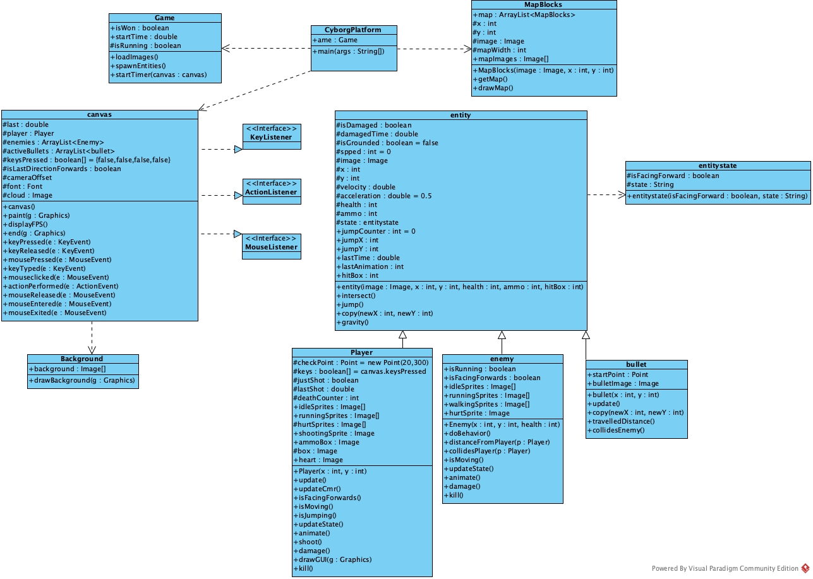
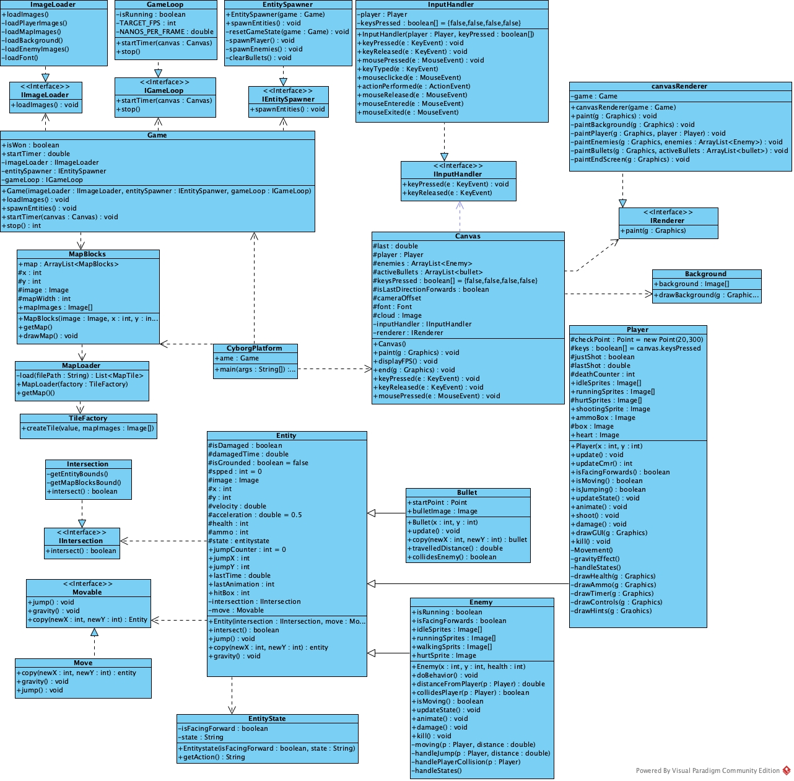

# Version 1

## Code Structure
This project is a compact Swing-based 2D platformer. The main components and their responsibilities are:

- `CyborgPlatform`:Application entry point that creates the main window and launches the `Game` session.
- `Game`: Loads resource images, initializes game entities and starts the frame loop.
- `canvas`: A Swing JComponent rendering scenes, handling user inputs and displaying FPS.
- `MapBlocks`: Loads and stores tiles, and renders them to graphics contexts.
- `Background`: Renders multi-layer parallax background.
- `entity` : A base class for `Player`, `enemy`, and `bullet`. It encapsulates shared attributes and behaviors.
- `entitystate`: A data class capturing facing and action state of entity.
- `Player` / `enemy` / `bullet`: Concrete actors extending `entity`, respectively manages states and behaviours of players, enemies and bullets.

At runtime, `CyborgPlatform` sets up the game and launches the loop in `Game.startTimer()`, which repeatedly triggers `canvas.paint()`. 
During each repaint, the `canvas` renders background, tiles and entities by delegating to their respective classes.

## Class Diagram - Version 1
This is the class diagram for version 1, showing classes in this program and their association.

Legend for the following diagram:
- **Solid line with hollow triangle:** Generalization (inheritance)
- **Dashed line with blue triangle:** Realization (interface implementation)
- **Dashed line:** Dependency

## Issues observed 
The codebase exhibits several design and maintainability issues and violates `SOLID` principles, resulting in tightly coupling. 

Key issues and their representative examples include:
- Large classes and long methods mix responsibilities and violate **Single Responsibility Principle**: `canvas` handles input loading, rendering and updating logic.
- Entities are not closed for modification, violating **Open-Closed Principle**: switch statements in `MapBlocks`
- High-level modules depend on low-level modules, violating **Dependency Inversion Principle**：`Game` depends on `Player`,`enemy` and so on.
- Repeated magic numbers: `tileX += 48` in `MapBlocks`.
- Duplicated Code: repeated `AABB` collision checks in `entity`, `Player`，`bullet` and `enemy`.
- Data-only classes without behavior: `entitystate`

# Version 2

## Refactor Plan
This refactoring focuses on architectural improvement, stronger modularity and readability, and closer alignment with SOLID principles.

- `Game`:  Responsibilities are separated into `ImageLoader`, `EntitySpawner`, and `GameLoop`, each connected to `Game` through the abstractions `IImageLoader`, `IEntitySpawner`, and `IGameLoop`, reducing coupling and clarifying module boundaries.
- `Canvas`: Decomposed into `InputHandler` and `CanvasRenderer`, connected via the `IInputHandler` and `IRenderer` interfaces to comply with the Dependency Inversion Principle. Utility function `displayFPS()` remains in `canvas`.
- `Entity` : Extracted behaviors into `IIntersection` and `Movable` interfaces.  `Intersection` and `Move` implement these interfaces respectively to isolate physics and collision logic from the core entity model.
- `entitystate`: Action-retrieval logic is added through `getAction()`.
- `Player`:
  - `update()` is decomposed into `movement()`, `gravityEffect()`, and `handleStates()`, while collision logic is delegated to  `IIntersection` . The original `update()` now simply coordinates these four responsibilities.
  - `drawGUI(Graphics g)` is split into `drawHealth()`, `drawAmmo()`, `drawTimer()`, `drawControls()`, `drawHints()`, while `drawGUI()` becomes a simple coordinator calling these rendering helpers.
- `Enemy` :`doBehavior()` is refactored into focused private methods -`moving(Player p, double distance)`,`handleJump(Player p, double distance)`,`handlePlayerCollision(Player p)`, and `handleStates()`, while `doBehavior()` manages them.
- `MapBlocks`: switch-based tile creation is replaced by polymorphism through a `TileFactory`. Map-Loading is delegated to  `MapLoader` class.

## Redesign Class Diagram - Version 2
In the redesigned class diagram, `canvas`,`entity`,`bullet` and `enemy`have been renamed to `Canvas`,`Entity`, `Bullet` and `Enemy`to conform to Java naming conventions.
The arrow notation follows the same legend used in Version 1 diagram.

# Version 3 (Current JavaFX MVC)

